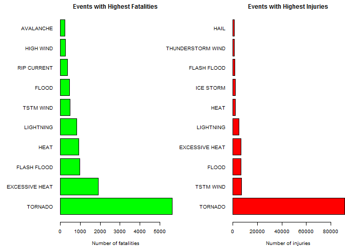
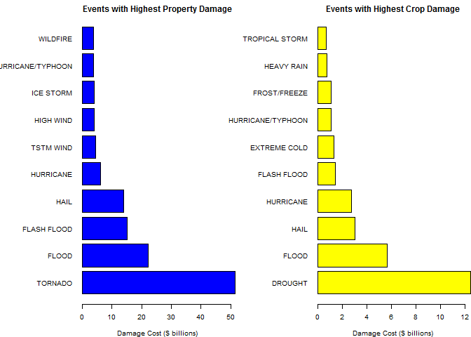

# Weather Event Analysis - NOAA Storm Database
Jack Welch  
November 3, 2016  

===========================================================================================================

## Synopsis

The United States National Oceanic and Atmospheric Administration (NOAA) has been capturing storm event data from 1950 to present.  This is a large data set which documents the date of significant weather events, their location, their strength, and their duration.  This data set further provides estimates related to each storm's impact on the health and safety of the public by recording property damage, casualties, injuries, and more.

We are going to conduct an important reproducible research exercise whereby we will programatically get this data, manipulate it where necessary in order to prepare for analysis, and we will then conduct a few data mining techniques which will allow us to analyze; and, most importantly, visualize the results of our analysis related to the severe weather events here in the United States.

We will address two very important questions as we complete our analysis:

1. Across the United States, which types of events are most harmful with respect to population health?
2. Across the United States, which types of events have the greatest economic consequences?

## Data Processing

### Set cache

This is a large data souce which takes several minutes to load into memory.  We will start by enabling cache within this document so that R Studio is not forced to load the 'activity' table each and every time we start KnitR during the preparation of this document.


```r
knitr::opts_chunk$set(cache=TRUE)
```

### Get Data from Source

We will start our analysis by programatically getting this remote data source.  To maintain data integrity and repeatability of this exercise, we will get this data directly from the source and not conduct any manual data manipulation which is not included herein this documented analysis.

Now, let's download the file (if we do not have a local copy), read this file into a data frame named 'stormdata', and then use the head() function in order to create an initial visualization of our data frame.


```r
if(!file.exists("repdata%2Fdata%2FStormData.csv.bz2")) {
    download.file("https://d396qusza40orc.cloudfront.net/repdata%2Fdata%2FStormData.csv.bz2", "repdata%2Fdata%2FStormData.csv.bz2")
}
stormdata <- read.csv("repdata%2Fdata%2FStormData.csv.bz2")
head(stormdata, n=10)
```

```
##    STATE__           BGN_DATE BGN_TIME TIME_ZONE COUNTY COUNTYNAME STATE
## 1        1  4/18/1950 0:00:00     0130       CST     97     MOBILE    AL
## 2        1  4/18/1950 0:00:00     0145       CST      3    BALDWIN    AL
## 3        1  2/20/1951 0:00:00     1600       CST     57    FAYETTE    AL
## 4        1   6/8/1951 0:00:00     0900       CST     89    MADISON    AL
## 5        1 11/15/1951 0:00:00     1500       CST     43    CULLMAN    AL
## 6        1 11/15/1951 0:00:00     2000       CST     77 LAUDERDALE    AL
## 7        1 11/16/1951 0:00:00     0100       CST      9     BLOUNT    AL
## 8        1  1/22/1952 0:00:00     0900       CST    123 TALLAPOOSA    AL
## 9        1  2/13/1952 0:00:00     2000       CST    125 TUSCALOOSA    AL
## 10       1  2/13/1952 0:00:00     2000       CST     57    FAYETTE    AL
##     EVTYPE BGN_RANGE BGN_AZI BGN_LOCATI END_DATE END_TIME COUNTY_END
## 1  TORNADO         0                                               0
## 2  TORNADO         0                                               0
## 3  TORNADO         0                                               0
## 4  TORNADO         0                                               0
## 5  TORNADO         0                                               0
## 6  TORNADO         0                                               0
## 7  TORNADO         0                                               0
## 8  TORNADO         0                                               0
## 9  TORNADO         0                                               0
## 10 TORNADO         0                                               0
##    COUNTYENDN END_RANGE END_AZI END_LOCATI LENGTH WIDTH F MAG FATALITIES
## 1          NA         0                      14.0   100 3   0          0
## 2          NA         0                       2.0   150 2   0          0
## 3          NA         0                       0.1   123 2   0          0
## 4          NA         0                       0.0   100 2   0          0
## 5          NA         0                       0.0   150 2   0          0
## 6          NA         0                       1.5   177 2   0          0
## 7          NA         0                       1.5    33 2   0          0
## 8          NA         0                       0.0    33 1   0          0
## 9          NA         0                       3.3   100 3   0          1
## 10         NA         0                       2.3   100 3   0          0
##    INJURIES PROPDMG PROPDMGEXP CROPDMG CROPDMGEXP WFO STATEOFFIC ZONENAMES
## 1        15    25.0          K       0                                    
## 2         0     2.5          K       0                                    
## 3         2    25.0          K       0                                    
## 4         2     2.5          K       0                                    
## 5         2     2.5          K       0                                    
## 6         6     2.5          K       0                                    
## 7         1     2.5          K       0                                    
## 8         0     2.5          K       0                                    
## 9        14    25.0          K       0                                    
## 10        0    25.0          K       0                                    
##    LATITUDE LONGITUDE LATITUDE_E LONGITUDE_ REMARKS REFNUM
## 1      3040      8812       3051       8806              1
## 2      3042      8755          0          0              2
## 3      3340      8742          0          0              3
## 4      3458      8626          0          0              4
## 5      3412      8642          0          0              5
## 6      3450      8748          0          0              6
## 7      3405      8631          0          0              7
## 8      3255      8558          0          0              8
## 9      3334      8740       3336       8738              9
## 10     3336      8738       3337       8737             10
```

### Data Frame Structure

List the structure of this data frame.  Here we will get a count of all of the data observations, the number of variables (or columns), and the data type contained within each of the columns.  This is a very helpful step when deciding which steps will follow in order to complete our analysis and visualization.


```r
# List the structure of this data frame
str(stormdata)
```

```
## 'data.frame':	902297 obs. of  37 variables:
##  $ STATE__   : num  1 1 1 1 1 1 1 1 1 1 ...
##  $ BGN_DATE  : Factor w/ 16335 levels "1/1/1966 0:00:00",..: 6523 6523 4242 11116 2224 2224 2260 383 3980 3980 ...
##  $ BGN_TIME  : Factor w/ 3608 levels "00:00:00 AM",..: 272 287 2705 1683 2584 3186 242 1683 3186 3186 ...
##  $ TIME_ZONE : Factor w/ 22 levels "ADT","AKS","AST",..: 7 7 7 7 7 7 7 7 7 7 ...
##  $ COUNTY    : num  97 3 57 89 43 77 9 123 125 57 ...
##  $ COUNTYNAME: Factor w/ 29601 levels "","5NM E OF MACKINAC BRIDGE TO PRESQUE ISLE LT MI",..: 13513 1873 4598 10592 4372 10094 1973 23873 24418 4598 ...
##  $ STATE     : Factor w/ 72 levels "AK","AL","AM",..: 2 2 2 2 2 2 2 2 2 2 ...
##  $ EVTYPE    : Factor w/ 985 levels "   HIGH SURF ADVISORY",..: 834 834 834 834 834 834 834 834 834 834 ...
##  $ BGN_RANGE : num  0 0 0 0 0 0 0 0 0 0 ...
##  $ BGN_AZI   : Factor w/ 35 levels "","  N"," NW",..: 1 1 1 1 1 1 1 1 1 1 ...
##  $ BGN_LOCATI: Factor w/ 54429 levels "","- 1 N Albion",..: 1 1 1 1 1 1 1 1 1 1 ...
##  $ END_DATE  : Factor w/ 6663 levels "","1/1/1993 0:00:00",..: 1 1 1 1 1 1 1 1 1 1 ...
##  $ END_TIME  : Factor w/ 3647 levels ""," 0900CST",..: 1 1 1 1 1 1 1 1 1 1 ...
##  $ COUNTY_END: num  0 0 0 0 0 0 0 0 0 0 ...
##  $ COUNTYENDN: logi  NA NA NA NA NA NA ...
##  $ END_RANGE : num  0 0 0 0 0 0 0 0 0 0 ...
##  $ END_AZI   : Factor w/ 24 levels "","E","ENE","ESE",..: 1 1 1 1 1 1 1 1 1 1 ...
##  $ END_LOCATI: Factor w/ 34506 levels "","- .5 NNW",..: 1 1 1 1 1 1 1 1 1 1 ...
##  $ LENGTH    : num  14 2 0.1 0 0 1.5 1.5 0 3.3 2.3 ...
##  $ WIDTH     : num  100 150 123 100 150 177 33 33 100 100 ...
##  $ F         : int  3 2 2 2 2 2 2 1 3 3 ...
##  $ MAG       : num  0 0 0 0 0 0 0 0 0 0 ...
##  $ FATALITIES: num  0 0 0 0 0 0 0 0 1 0 ...
##  $ INJURIES  : num  15 0 2 2 2 6 1 0 14 0 ...
##  $ PROPDMG   : num  25 2.5 25 2.5 2.5 2.5 2.5 2.5 25 25 ...
##  $ PROPDMGEXP: Factor w/ 19 levels "","-","?","+",..: 17 17 17 17 17 17 17 17 17 17 ...
##  $ CROPDMG   : num  0 0 0 0 0 0 0 0 0 0 ...
##  $ CROPDMGEXP: Factor w/ 9 levels "","?","0","2",..: 1 1 1 1 1 1 1 1 1 1 ...
##  $ WFO       : Factor w/ 542 levels ""," CI","$AC",..: 1 1 1 1 1 1 1 1 1 1 ...
##  $ STATEOFFIC: Factor w/ 250 levels "","ALABAMA, Central",..: 1 1 1 1 1 1 1 1 1 1 ...
##  $ ZONENAMES : Factor w/ 25112 levels "","                                                                                                                               "| __truncated__,..: 1 1 1 1 1 1 1 1 1 1 ...
##  $ LATITUDE  : num  3040 3042 3340 3458 3412 ...
##  $ LONGITUDE : num  8812 8755 8742 8626 8642 ...
##  $ LATITUDE_E: num  3051 0 0 0 0 ...
##  $ LONGITUDE_: num  8806 0 0 0 0 ...
##  $ REMARKS   : Factor w/ 436781 levels "","-2 at Deer Park\n",..: 1 1 1 1 1 1 1 1 1 1 ...
##  $ REFNUM    : num  1 2 3 4 5 6 7 8 9 10 ...
```

### Subset this data frame

Let's now subset this data so that it only includes the data that we will need in order to complete our analysis.  We simply need this table reduced in size so that it only includes the following variables: EVTYPE, FATALITIES, INJURIES, PROPDMG, PROPDMGEXP, CROPDMG, CROPDMGEXP.


```r
# Subset this data frame and show header
stormdataset <- stormdata[,c("EVTYPE", "FATALITIES", "INJURIES", "PROPDMG", "PROPDMGEXP", "CROPDMG", "CROPDMGEXP")]

# Output the head rows of this data frame
head(stormdataset, n=10)
```

```
##     EVTYPE FATALITIES INJURIES PROPDMG PROPDMGEXP CROPDMG CROPDMGEXP
## 1  TORNADO          0       15    25.0          K       0           
## 2  TORNADO          0        0     2.5          K       0           
## 3  TORNADO          0        2    25.0          K       0           
## 4  TORNADO          0        2     2.5          K       0           
## 5  TORNADO          0        2     2.5          K       0           
## 6  TORNADO          0        6     2.5          K       0           
## 7  TORNADO          0        1     2.5          K       0           
## 8  TORNADO          0        0     2.5          K       0           
## 9  TORNADO          1       14    25.0          K       0           
## 10 TORNADO          0        0    25.0          K       0
```

```r
# Let's look at a summary of the data frame
summary(stormdataset)
```

```
##                EVTYPE         FATALITIES          INJURIES        
##  HAIL             :288661   Min.   :  0.0000   Min.   :   0.0000  
##  TSTM WIND        :219940   1st Qu.:  0.0000   1st Qu.:   0.0000  
##  THUNDERSTORM WIND: 82563   Median :  0.0000   Median :   0.0000  
##  TORNADO          : 60652   Mean   :  0.0168   Mean   :   0.1557  
##  FLASH FLOOD      : 54277   3rd Qu.:  0.0000   3rd Qu.:   0.0000  
##  FLOOD            : 25326   Max.   :583.0000   Max.   :1700.0000  
##  (Other)          :170878                                         
##     PROPDMG          PROPDMGEXP        CROPDMG          CROPDMGEXP    
##  Min.   :   0.00          :465934   Min.   :  0.000          :618413  
##  1st Qu.:   0.00   K      :424665   1st Qu.:  0.000   K      :281832  
##  Median :   0.00   M      : 11330   Median :  0.000   M      :  1994  
##  Mean   :  12.06   0      :   216   Mean   :  1.527   k      :    21  
##  3rd Qu.:   0.50   B      :    40   3rd Qu.:  0.000   0      :    19  
##  Max.   :5000.00   5      :    28   Max.   :990.000   B      :     9  
##                    (Other):    84                     (Other):     9
```

### Data Cleansing

Per page 12 of the [Storm Data Documentation](https://d396qusza40orc.cloudfront.net/repdata%2Fpeer2_doc%2Fpd01016005curr.pdf), the *Storm Data* preparer enters the storm damage in 3 significant digits (these 3 digits are recorded in the PROPDMG and CROPDMG columns).  The preparer then chooses the magnitude of these expenses in "B" billions, "M" millions, and "K" thousands.  The magnitude of the expenses are recorded in the columns PROPDMGEXP and CROPDMGEXP.

We further observe from the output of the structure function above that the fields PROPDMG and CROPDMG are numeric fields.  The columns labelled PROPDMGEXP and CROPDMGEXP are factors each with some values which we now want to be able to better understand.  

Let's now visualize the content of the PROPDMGEXP and CROPDMGEXP columns by outputting the unique values of each of these columns.


```r
# Output the unique values of PROPDMGEXP
unique(stormdataset$PROPDMGEXP)
```

```
##  [1] K M   B m + 0 5 6 ? 4 2 3 h 7 H - 1 8
## Levels:  - ? + 0 1 2 3 4 5 6 7 8 B h H K m M
```

```r
# Output the unique values of CROPDMGEXP
unique(stormdataset$CROPDMGEXP)
```

```
## [1]   M K m B ? 0 k 2
## Levels:  ? 0 2 B k K m M
```

Here we confirm that the content of the PROPDMGEXP and the CROPDMGEXP fields are letter codes representing the numeric magnitude of the storm.  We observe also that there are some other codes which within these columns which are not explained within the documentation.  Further observation indicates that the frequency of occurrence of values other then 'B', 'M', 'K' or '' are rather insignificant.  We are going to choose to ignore values other than those indicated as 'B', 'M', 'K' or ''.

We need to create new columns within this *stormdataset* data frame which will provide the numerical equivalent of these fields.


```r
# Create a function which returns a multiplication factor based on the letter code
getFactor <- function(m) {
    if (m == "B")
        return(1000000)
    else if (m == "M")
        return(1000000)
    else if (m == "K")
        return(1000)
    else if (m == "")
        return(1)
    else 
        return(0)
}

# Assign two new variables which will calculate the propexpense and the cropexpense as an integer
propexpense <- sapply(stormdataset$PROPDMGEXP, FUN=getFactor)
cropexpense <- sapply(stormdataset$CROPDMGEXP, FUN=getFactor)

# Initialize two new numeric columns within the data frame
stormdataset$PROPEXPENSE <- stormdataset$PROPDMG * (propexpense)
stormdataset$CROPEXPENSE <- stormdataset$CROPDMG * (cropexpense)

# Output a summary of this table in order to visualize the change with the new data columns
summary(stormdataset)
```

```
##                EVTYPE         FATALITIES          INJURIES        
##  HAIL             :288661   Min.   :  0.0000   Min.   :   0.0000  
##  TSTM WIND        :219940   1st Qu.:  0.0000   1st Qu.:   0.0000  
##  THUNDERSTORM WIND: 82563   Median :  0.0000   Median :   0.0000  
##  TORNADO          : 60652   Mean   :  0.0168   Mean   :   0.1557  
##  FLASH FLOOD      : 54277   3rd Qu.:  0.0000   3rd Qu.:   0.0000  
##  FLOOD            : 25326   Max.   :583.0000   Max.   :1700.0000  
##  (Other)          :170878                                         
##     PROPDMG          PROPDMGEXP        CROPDMG          CROPDMGEXP    
##  Min.   :   0.00          :465934   Min.   :  0.000          :618413  
##  1st Qu.:   0.00   K      :424665   1st Qu.:  0.000   K      :281832  
##  Median :   0.00   M      : 11330   Median :  0.000   M      :  1994  
##  Mean   :  12.06   0      :   216   Mean   :  1.527   k      :    21  
##  3rd Qu.:   0.50   B      :    40   3rd Qu.:  0.000   0      :    19  
##  Max.   :5000.00   5      :    28   Max.   :990.000   B      :     9  
##                    (Other):    84                     (Other):     9  
##   PROPEXPENSE         CROPEXPENSE       
##  Min.   :        0   Min.   :        0  
##  1st Qu.:        0   1st Qu.:        0  
##  Median :        0   Median :        0  
##  Mean   :   168133   Mean   :    39341  
##  3rd Qu.:      500   3rd Qu.:        0  
##  Max.   :929000000   Max.   :596000000  
## 
```

### Table Calculations

It is our goal to address the two following questions:

1. Across the United States, which types of events are most harmful with respect to population health?


```r
# Aggregate the data by event and calculate the sum of the fatalities and injuries
fatalities <- aggregate(FATALITIES ~ EVTYPE, stormdataset, FUN = sum)
injuries <- aggregate(INJURIES ~ EVTYPE, stormdataset, FUN = sum)

# List top 10 events with highest fatalities - order in descending order
fatalitiestop <- fatalities[order(-fatalities$FATALITIES), ][1:10, ]

# List top 10 events with highest injuries - order in descending order
injuriestop <- injuries[order(-injuries$INJURIES), ][1:10, ]

# Produce bar plots for data visualization
par(mfrow = c(1, 2), mar = c(4, 10, 2, 0), mgp = c(3, 1, 0), cex = 0.6)

barplot(fatalitiestop$FATALITIES, horiz=TRUE, names.arg = fatalitiestop$EVTYPE, main = "Events with Highest Fatalities", xlab = "Number of fatalities", col = "green", las=1)

barplot(injuriestop$INJURIES, horiz=TRUE, names.arg = injuriestop$EVTYPE, main = "Events with Highest Injuries", xlab = "Number of injuries", col = "red", las=1)
```

<!-- -->

2. Across the United States, which types of events have the greatest economic consequences?


```r
# Aggregate the data by event
propdamage <- aggregate(PROPEXPENSE ~ EVTYPE, stormdataset, FUN = sum)
cropdamage <- aggregate(CROPEXPENSE ~ EVTYPE, stormdataset, FUN = sum)

# List top 10 events with highest property damage - order in descending order
propdamagetop <- propdamage[order(-propdamage$PROPEXPENSE), ][1:10, ]

# List top 10 events with highest crop damage - order in descending order
cropdamagetop <- cropdamage[order(-cropdamage$CROPEXPENSE), ][1:10, ]

# Produce bar plots for data visualization
par(mfrow = c(1, 2), mar = c(4, 10, 2, 0), mgp = c(3, 1, 0), cex = 0.6)

barplot(propdamagetop$PROPEXPENSE/(10^9), horiz=TRUE, names.arg = propdamagetop$EVTYPE, main = "Events with Highest Property Damage", xlab = "Damage Cost ($ billions)", col = "blue", las=1)

barplot(cropdamagetop$CROPEXPENSE/(10^9), horiz=TRUE, names.arg = cropdamagetop$EVTYPE, main = "Events with Highest Crop Damage", xlab = "Damage Cost ($ billions)", col = "yellow", las=1)
```

<!-- -->

## Results

According to our analysis, it has been determined that the *Tornado* is the most harmful event in the United States, contributing to over 5K fatalties, 80K injuries, and over $50 billion in property damage.  Crop damage seems to be somewhat resilient to the tornado since the top 10 weather events contributing to the greatest crop damage does not include the tornado.  In fact, the weather event contributing to the greates crop damage would be a *Drought*.


